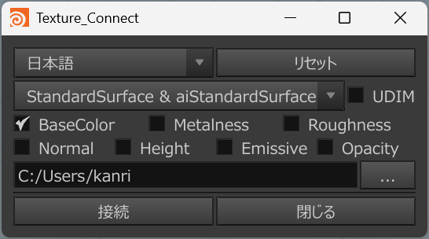
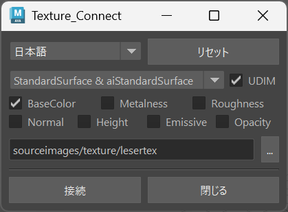

# texture-Connector-maya_houdini

  
[English Version](./README_EN.md)

## 概要
AdobeSubstancePainterで出力したテクスチャをMaya/Houdiniに簡単にアサインするツールです。  
手動でのテクスチャ接続作業を省き、時間と手間を削減します。

## 要件
- Maya 2022 以上 または Houdini 19 以上  

## 使い方
### Maya インストール
gitをインストール済みの場合、以下のコマンドを実行してパッケージをインストールします。  
```bash
/Applications/Autodesk/maya(バージョン)/bin/mayapy -m pip install git+https://github.com/FugeTA/texture-Connector-maya_houdini.git --user
```
または、手動でダウンロードしたパッケージをインストールします。  
```bash
/Applications/Autodesk/maya(バージョン)/bin/mayapy -m pip install (ダウンロードしたファイル) --user
```

### Houdini インストール
gitをインストール済みの場合、以下のコマンドを実行してパッケージをインストールします。  
```bash
/Applications/Side Effects Software/Houdini(バージョン)/python(バージョン)/python.exe -m pip install git+https://github.com/FugeTA/texture-Connector-maya_houdini.git --user
```
または、手動でダウンロードしたパッケージをインストールします。  
```bash
/Applications/Side Effects Software/Houdini(バージョン)/python(バージョン)/python.exe -m pip install (ダウンロードしたファイル) --user
```
userオプションでインストールすることで、ユーザーディレクトリにパッケージがインストールされます。  
その結果、インストールしたパッケージを、MayaとHoudiniの両方で使用することができます。

### ツールの実行
MayaまたはHoudiniのスクリプトエディタで、以下のコマンドを実行します。  
```python
import texture_connector
texture_connector.openWindow()
```
## 説明
1. Substance PainterでArnoldテンプレートを使用し、テクスチャを出力する。  
2. ツール内でマテリアルを選択する。  
3. 画像ファイルの入っているフォルダを選択する。  
4. "Connect" ボタンで実行できる。  

### 注意点
- マテリアル名は、Substance Painterで出力した名前と一致させる必要があります。
- Houdiniでは、KarmaMateralBuilderなどで作成したSubnetworkの名前を一致させる必要があります。

## 作者
[Twitter](https://x.com/cotte_921)

## ライセンス
このプロジェクトは [MIT](./LICENSE) ライセンスの下で公開されています。
