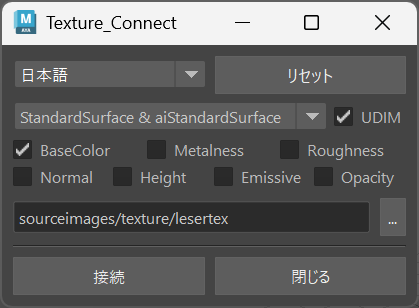

# texture-Connector-maya_houdini


[日本語版](./README.md)

## Overview
This tool simplifies the process of assigning textures exported from Adobe Substance Painter to Maya or Houdini.  
It eliminates the need for manual texture connection tasks, saving time and effort.

## Requirements
- Maya 2022 or later, or Houdini 19 or later  

## Usage
### Maya Installation
If Git is installed, run the following command to install the package:  
```bash
/Applications/Autodesk/maya(version)/bin/mayapy -m pip install git+https://github.com/FugeTA/texture-Connector-maya_houdini.git --user
```
Alternatively, manually download the package and install it:  
```bash
/Applications/Autodesk/maya(version)/bin/mayapy -m pip install (downloaded file) --user
```

### Houdini Installation
If Git is installed, run the following command to install the package:  
```bash
/Applications/Side Effects Software/Houdini(version)/python(version)/python.exe -m pip install git+https://github.com/FugeTA/texture-Connector-maya_houdini.git --user
```
Alternatively, manually download the package and install it:  
```bash
/Applications/Side Effects Software/Houdini(version)/python(version)/python.exe -m pip install (downloaded file) --user
```
By using the `--user` option, the package will be installed in the user's directory.  
As a result, the installed package can be used in both Maya and Houdini.

### Running the Tool
Run the following command in the script editor of Maya or Houdini:  
```python
import texture_connector
texture_connector.openWindow()
```

## Instructions
1. Use the Arnold template in Substance Painter to export textures.  
2. Select the material in the tool.  
3. Choose the folder containing the image files.  
4. Click the "Connect" button to execute.  

## Notes
- The material name must match the name exported from Substance Painter.

## Author
[Twitter](https://x.com/cotte_921)

## License
This project is licensed under the [MIT](./LICENSE) License.